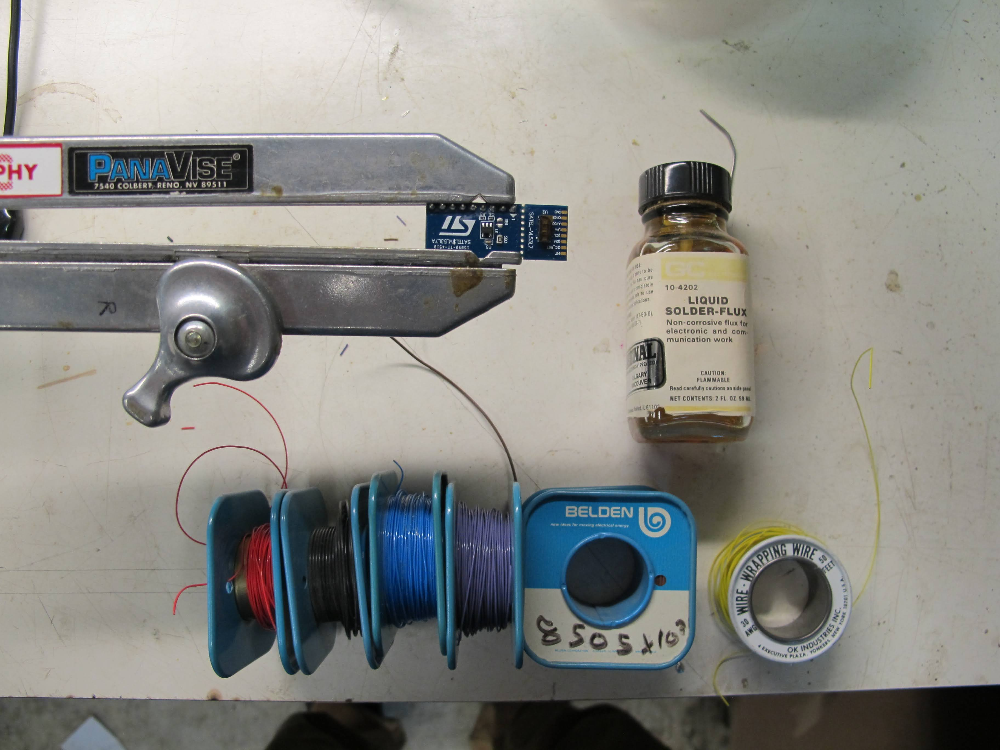
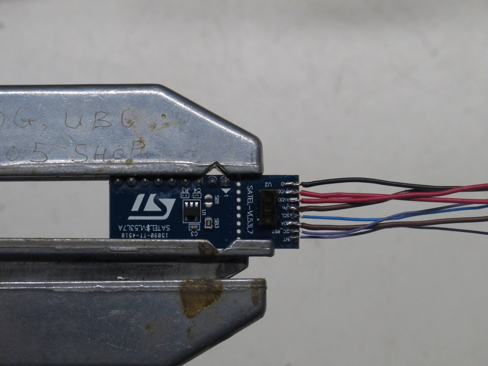

# esp32-sense-and-send
An 18m flume in the Flume Lab at UBC can benefit from having better water surface level data during experiments. The flume is already equipped with a Parker linear rail that traverses the length of the flume. This project is to avoid the mess of adding another wire connection to the cart on the linear rail. Another ESP32 is needed for ESP-NOW.

## Components
- ESP32C5 x 2
- ST's SATEL-VL53L7CX Breakout Board (ToF Sensor)
- 2.2kOhm resistors x 2

## SATEL-VL53L7CX
There is a lot of contradicting/confusing information on the internet about reading data from these breakout boards. The breakouts are convenient as they can be ready to go right out of the box. I wasn't able to get any data from the through hole pins, but I did get data after soldering flywires to the 9 pads on the PCB. I used 28 gauge stranded wire for the power and ground pins and 32 gauge for everything else. I tried using 22 gauge stranded wire but ripped off a solder pad. Small diameter wires are preferred.

    | VL53L7CX Solder Pad Name | ESP32C5 Connection | 
    | --- | --- |
    | INT | NC |
    | I2C_RST | NC |
    | SDA | GPIO_24 |
    | SCL | GPIO_23 |
    | LPn | NC |
    | AVDD | 3.3V |
    | IOVDD | 3.3V |
    | GND | GND |

## Examples for ESP-IDF
- examples/ranging_basic
    This is a minimal example to read data from the ToF sensor. The SDA and SCL are set to be GPIO_24 and GPIO_23 respectively. 

## Function

There are three computers involved in this system. The first computer is an ESP32C5 (Data Acquisition ESP32) connected directly to the ToF sensor and sends data to the second ESP32. The second is another ESP32C5 (Data Bridge ESP32) which receives the data from the Data Acquisition ESP32. The Data Bridge uses a wired serial connection directly to the host computer. The data bridge is a convenient way to not need to wire another really long wire along the flume. The host computer (Camera Cart Computer) gets the data and uses Python to convert the data into the desired coordinate reference system.

### Data Acquisition ESP32

- ~/data_acquisition/main/main.c
- This ESP32 is responsible for 
    1. Retrieving data from the ToF Sensor
    2. Sending this data using ESPNOW to the Data Bridge ESP32

### Data Bridge ESP32

- ~/data_bridge/main/main.c
- This ESP32 is responsible for 
    1. Receiving data through ESPNOW
    2. Routing this received data to a wired serial UART connection (host computer)

### Camera Cart Computer

- ~host_python/main.py 
- This Python script is responsible for 
    1. Receiving data through a wired UART connection
    2. Transforming the data into a cartesian coordinate system relative to the sensor (see /docs/sensor_fov_description.pdf)
    3. Transforming the data into a new coordinate reference system relative to the flume (see /docs/water_surface_level_side_view.pdf)
    4. Tracking the cart position along the flume 
    5. Appending data to a .csv file 